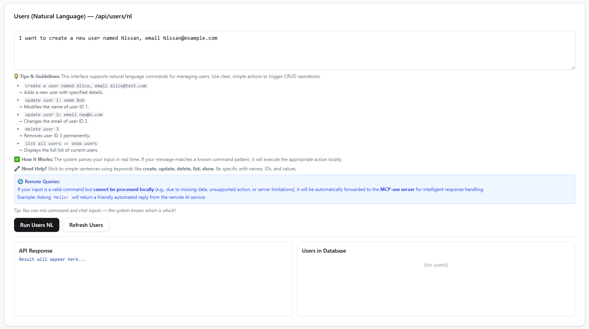

# 🌐 Natural Language MCP-Data-Boost / User Management Demo

A demo application that allows managing users via **natural language commands**.  
You can create, update, delete, and list users just by typing sentences in plain English (or Vietnamese).

---

## ✨ Features

- ✅ **Natural Language Input** – e.g., `"create a user named Alice, email alice@test.com"`
- ✅ **Smart Parsing** – Uses **LLM + MCP tools** to interpret user intent
- ✅ **Fallback CRUD Parser** – Falls back to JSON parsing if tool call fails
- ✅ **Real-time UI** – View and manage users in a clean React interface
- ✅ **Auto-refresh** – User list updates automatically after changes
- ✅ **Clear Instructions** – Built-in tips for supported commands

---

## ⚙️ Supported Actions

| Action                | Example                                                                 |
|-----------------------|-------------------------------------------------------------------------|
| **Create**            | `create a user named Bob, email bob@example.com`                        |
| **Update**            | `update user 1: name Alice` or `change email of user 2 to alice@new.com`|
| **Delete**            | `delete user 3` or `remove user with id 3`                              |
| **List**              | `list all users` or `show users`                                        |
| **Bulk Create**       | `create 5 users named Dev`                                              |
| **Bulk Create Random**| `create 10 random users` · `tạo 3 người dùng ngẫu nhiên` · `make 2 random testers` |
| **None** *(fallback)* | `what is the weather today?` → not related to user management            |

---

## 🔎 How It Works

1. **User Input** – You type a command in natural language, e.g., *"delete user 3"*  
2. **Frontend → Backend** – The request is sent to FastAPI at `/api/users/nl`  
3. **Backend Processing**:
   - First tries to use **MCP tools**  
   - If tools are not available → fallback LLM parser  
   - Executes CRUD operations on `data/users.json`  
4. **Response** – The result is returned, UI refreshes automatically  

🌐 **Remote Queries**:  
If the input is valid but cannot be processed locally (missing data, unsupported action, etc.),  
it is automatically forwarded to the **MCP-use server** for intelligent response handling.  

💡 *Tip*: You can mix chat + command inputs — the system will recognize which is which.  

---

## 🛠️ Tech Stack

- **Frontend** → React + Tailwind CSS + ShadCN UI  
- **Backend** → FastAPI (Python)  
- **LLM** → OpenAI GPT models  
- **Tooling** → [MCP (Model Context Protocol)](https://github.com/isi-mcp), MCP-use  
- **Storage** → Local JSON file (`data/users.json`)  

---

## 🖥️ Run the Backend

Choose one of the server options below (all based on **Uvicorn**):

```bash
  # Simple server
  uvicorn simple_server:app --host 0.0.0.0 --port 8000 --reload

  # Server with customization
  uvicorn server_customization:app --host 0.0.0.0 --port 8000 --reload

  # Multi-agents server
  uvicorn server_multi_agents:app --host 0.0.0.0 --port 8000 --reload

  # Dynamic server
  uvicorn dynamic_server:app --host 0.0.0.0 --port 8000 --reload

  # Dynamic server with customization
  uvicorn dynamic_server_customization:app --host 0.0.0.0 --port 8000 --reload

  # Main API server
  uvicorn main:app --host 0.0.0.0 --port 8000 --reload

👉 The backend will be available at http://localhost:8000
```

---

🌟 Run the Frontend
```bash
  # 1. Navigate to the frontend directory
  cd mcp-json-ui

  # 2. Install dependencies
  npm install

  # 3. Start the development server
  npm run dev

👉 Open your browser at http://localhost:5173
```


---

📂 Server Customization Example

server_customization.py – A customizable MCP server that integrates with tools + local JSON database.
- MCP Tool Hosting: Exposes CRUD as MCP tools
- Natural Language Interface: Free-text commands parsed by LLM
- Persistent Data: Stored in data/users.json
- Integration Ready: Compatible with langchain, mcp SDKs, multi-agent systems

CRUD operations supported:
| Operation     | Description                      |
| ------------- | -------------------------------- |
| `create_user` | Add a new user with name & email |
| `list_users`  | Retrieve all users               |
| `update_user` | Modify name or email by ID       |
| `delete_user` | Remove a user by ID              |

✅ Email uniqueness enforced
✅ IDs auto-incremented
---
📖 Examples (IN → OUT)
```bash
  Ex1 IN:  "create a new user named Minh, email minh@example.com"
  Ex1 OUT: {"action":"create","name":"Minh","email":"minh@example.com"}

  Ex2 IN:  "delete user with id 3"
  Ex2 OUT: {"action":"delete","id":3}

  Ex3 IN:  "update user 2: name Nam, email nam@abc.com"
  Ex3 OUT: {"action":"update","id":2,"name":"Nam","email":"nam@abc.com"}

  Ex4 IN:  "list all users"
  Ex4 OUT: {"action":"list"}

  Ex5 IN:  "what is the weather today?"
  Ex5 OUT: {"action":"none","reason":"Question not related to user management"}

  Ex6 IN:  "create 5 users named Dev"
  Ex6 OUT: {"action":"bulk_create","name":"Dev","count":5}

  Ex7 IN:  "tạo 3 người dùng ngẫu nhiên"
  Ex7 OUT: {"action":"bulk_create_random","count":3}

  Ex8 IN:  "create 10 random users"
  Ex8 OUT: {"action":"bulk_create_random","count":10}

  Ex9 IN:  "make 2 random testers"
  Ex9 OUT: {"action":"bulk_create_random","count":2}

```

---
## 🔄 MCP Workflow Diagram

```mermaid
flowchart TD
    %% === Styles ===
    classDef start    fill:#ffeb3b,stroke:#333,stroke-width:2px,color:#000;
    classDef step     fill:#bbdefb,stroke:#1a237e,stroke-width:1px,color:#000;
    classDef decision fill:#ffe082,stroke:#ff6f00,stroke-width:1px,color:#000;
    classDef process  fill:#c8e6c9,stroke:#2e7d32,stroke-width:1px,color:#000;
    classDef note     fill:#f5f5f5,stroke:#666,stroke-dasharray: 3 3,color:#000;

    %% === Core Nodes ===
    A[Start] --> B[Load Configuration]
    B --> C[Initialize Servers]
    C --> D[Discover Tools]
    D --> E[Format Tools for LLM]
    E --> F[Wait for User Input]
    
    F --> G{User Input Received?}
    G --> H[Send Input to LLM]
    H --> I{LLM Decision}
    I -->|🔧 Tool Call| J[Execute Tool]
    I -->|💬 Direct Response| K[Return Response to User]
    
    J --> L[Return Tool Result]
    L --> M[Send Result to LLM]
    M --> N[LLM Interprets Result]
    N --> O[Present Final Response to User]
    
    K --> O
    O --> F

    %% === Explanations ===
    A_note[🔹 Entry point of the workflow]:::note -.-> A
    B_note[🔹 Load configuration files: API keys, environment variables, system settings]:::note -.-> B
    C_note[🔹 Establish server sessions for available services]:::note -.-> C
    D_note[🔹 Query servers to discover accessible tools]:::note -.-> D
    E_note[🔹 Convert tool specs into schemas for LLM use]:::note -.-> E
    F_note[🔹 Idle state — waiting for user request]:::note -.-> F
    G_note[🔹 Decision: check if user has submitted input]:::note -.-> G
    H_note[🔹 Forward user query to the LLM for reasoning]:::note -.-> H
    I_note[🔹 Decision: respond directly or invoke a tool]:::note -.-> I
    J_note[🔹 Execute the selected tool as instructed by LLM]:::note -.-> J
    L_note[🔹 Tool produces raw results]:::note -.-> L
    M_note[🔹 Send results back to LLM for interpretation]:::note -.-> M
    N_note[🔹 LLM refines, interprets, and structures the answer]:::note -.-> N
    O_note[🔹 User receives the final, polished response]:::note -.-> O
    K_note[🔹 Path where LLM answers without tool usage]:::note -.-> K

    %% === Apply Styles ===
    class A start;
    class B,C,D,E,F step;
    class G,I decision;
    class H,J,L,M,N process;
